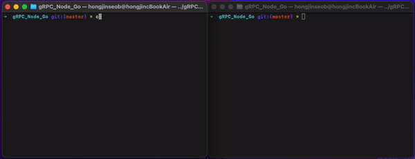
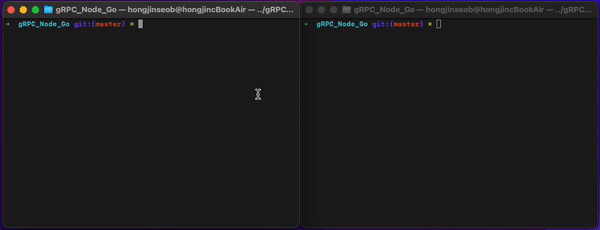
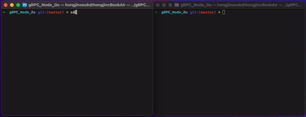
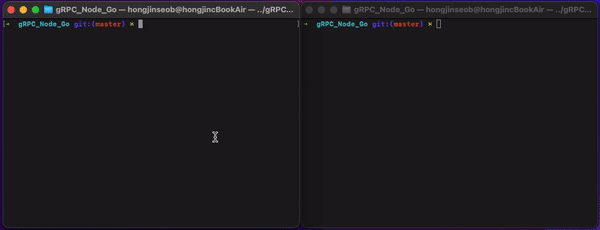

# gRPC in Node/Go

## About this project

Implement gRPC communication in Node(client-side) and Go(server-side)

## Getting started

### Prerequisites

[Go][1]

[Node][2]

### How to run

1. Clone this repository using <code> git clone - </code>

1. Get node packages using <code> npm install </code> in project root directory.

1. For each folders(examples),

    - To run server program implemented in Go,
        - <code> go get </code> to get packages,
        - <code> go run server.go </code>

    - To run client program implemented in Node, <code> node client.js </code>

- If you want to change protobuf files and recompile, 

    <code>protoc --go_out=. --go_opt=paths=source_relative \
    --go-grpc_out=. --go-grpc_opt=paths=source_relative \
    ./folder_name/file_name.proto </code>

    [Reference][3]

    You only have to generate compiled Go files.

## Preview

- Unary communication

- Bidirectional communication

- Client-Streaming communication

- Server-Streaming communication

## LICENSE

Distributed under the MIT License.

[1]: https://go.dev/learn/
[2]: https://nodejs.org/ko/download/
[3]: https://grpc.io/docs/languages/go/basics/#generating-client-and-server-code